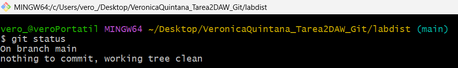
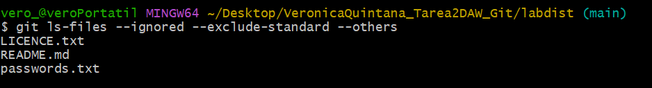
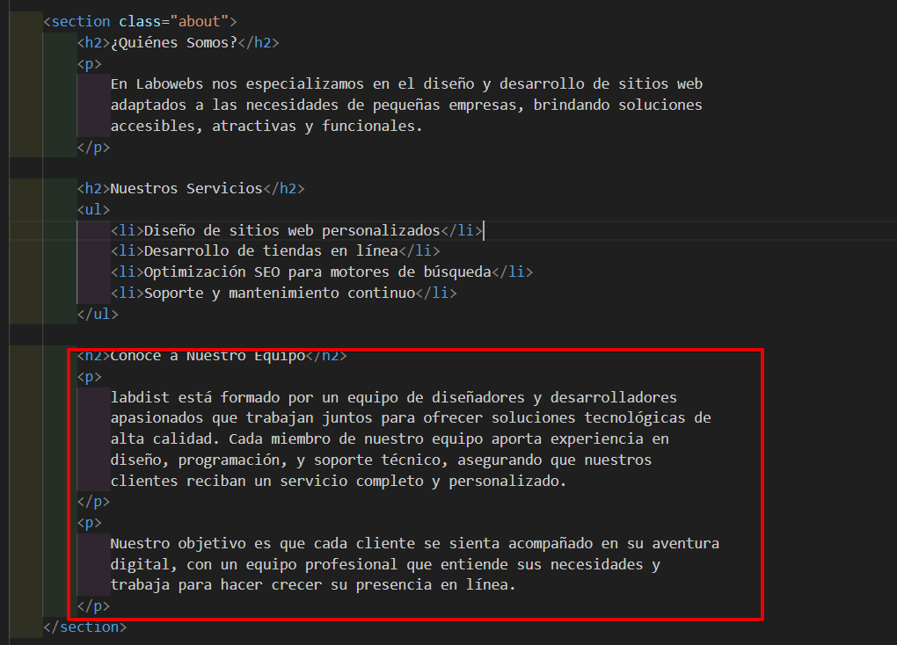
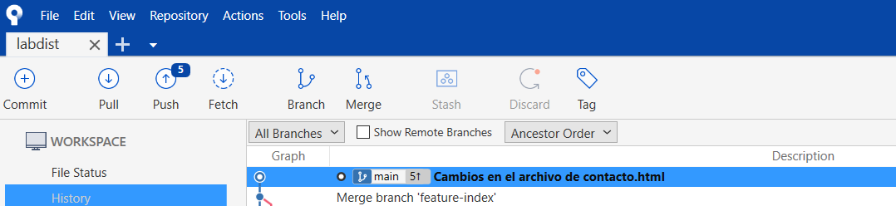
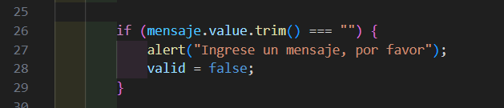
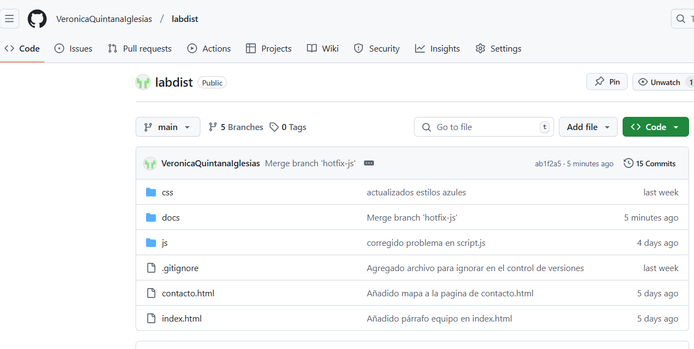

# Tarea 2 Git - Proyecto labdist

> Realizado por Verónica Quintana

[TOC]

## Trabajo en local 

### Punto 1

Inicializa un nuevo repositorio Git en una carpeta llamada `"labdist"` y agrega los archivos proporcionados en el aula virtual. Renombra la rama master a main , si es necesario. Realiza el primer commit. Muestra el log del repositorio

```bash
git init
git status
git add .
git status
git branch -M main
git commit -m "Commit de inicio"
git log
```


### Punto 2

Incluye un fichero `.gitignore` para que los ficheros `README.md` , `LICENCE.txt` y `passwords.txt` sean ignorados por el control de versiones. Realiza el commit y muestra los logs del repositorio en una línea.


Con estos dos primeros comandos, creo el archivo y le indico que abra el bloc de notas para editarlo

```bash
touch .gitignore
notepad .gitignore
```


​		Aqui esta el bloc de notas abierto y con los archivos que se desea incluir para que el control de versiones los ignore


```bash
git status
git add .
git commit -m "Agregado archivo para ignorar en el control de versiones"
git log 
git log --oneline
```


> [!NOTE]
>
> En este caso te agrego después la captura del log en una línea porque al leer rápido, solo leí log y no me di cuenta que fuese en una línea


### Punto 3

En el repositorio, crea los archivos `README.md` , `LICENCE.txt` y `passwords.txt` con algún contenido. Muestra el estado del repositorio. Muestra el listado de archivos ignorados.

- Archivos creados


- Hacer commit para confirmar los cambios

  ```bash
  git add  .
  git commit -m "Agreagr los archivos README, LICENCE y passwords"
  ```

  


- Mostrar el estado del repositorio

  ```bash
  git status
  ```

  

- Mostrar los archivos ignorados

  ```
  git ls-files --ignored --exclude-standard --others
  ```

  




### Punto 4

Crea una rama `feature-estilos` . Cámbiate a ella. 


- Modifica el archivo `estilos.css` : 
  - propiedad color del `body` y de `h2` : `#2a2a2a` 
  - propiedad `background-color` de `header` y `footer`: `#2a75ff` 
  
- Comprueba el estado del repositorio. Añade los cambios, realiza un commit con el mensaje "actualizados estilos a azules"

  ```bash
  git branch feature-estilos
  git branch -av
  git checkout feature-estilos
  git branch -av
  ```

  


​	

> [!NOTE]
>
> En este caso, use el comando `git branch -av` para mostrar las ramas que hay en dos ocasiones, una antes de cambiar y otra después para que se vea el cambio de una a otra


```bash
code css/estilos.css
```


Con este comando, abro el Visual Studio Code y modifico y guardo los cambios solicitados ahí


Para comprobar el estado del repositorio

```bash
git status
```


Añadir los cambios y commit


```
git add .
git commit -m "actualizados estilos azules"
```


### Punto 5

Vuelve a la rama `main` . En el archivo `index.html` añade un comentario donde se indique tu nombre como autor de la página. Comprueba el estado del repositorio. Añade los cambios, realiza un commit con el mensaje **añadido autor en index**. Muestra los logs del repositorio en una línea, gráficamente y con 'decoración'

```bash
git checkout main
code index.html
git add .
git commit -m "añadido autor en index"
git log --oneline --graph --decorate
```


### Punto 6


Fusiona la rama `feature-estilos` en la rama `main` . Muestra los logs del repositorio en una línea, gráficamente y con **'decoración'** 

```bash
git merge feature-estilos
git log --oneline --graph --decorate
```


> [!NOTE]
>
> Al fusionar la rama `feature-estilos` con la rama `main` aparece este mensaje en **Visual Studio Code** (el editor que tengo configurado por defecto)


## Trabajo en remoto


### Punto 1

Continúa con el repositorio `labdist` . Añade el repositorio a Sourcetree.

- A través de la opcion de clonar, agregue el repositorio tal y como lo tenia creado y modificado después de haber trabajado con el en local

  


​	

### Punto 2

En tu cuenta de GitHub, crea un repositorio remoto y sube al remoto los ficheros de tu repositorio local. Debes subir todas las ramas. Muestra, además, la captura de pantalla donde se vean en GitHub, algo similar a esto:


- Con esta opcion en git, se crea  un repositorio


- Se copia la url que proporciona en Sourcetree


- Con `Push`, se suben las ramas que hay

  


- Esto es lo que me quedaría subido en git, al haber fusionado la rama que había creado en local con la de `main` solo me aparecía para subir la rama `main`

  


### Punto 3

​	En el documento del enunciado de la tarea, no hay punto 3 en remoto


### Punto 4

En el repositorio local, crea una rama `feature-index` . Añade el siguiente código dentro de la `<section class="about">`. Añade los cambios y crea un commit con el mensaje **"Añadido párrafo equipo en index.html"**. Sube los cambios al remoto. (Recuerda que debes usar SourceTree en todo este apartado )


​		Se agrega en el archivo `index.html` el código en la sección indicada y se hace el comit




### Punto 5

En el repositorio local, fusiona la rama feature-index en la rama main .


### Punto 6

Edita el fichero `contacto.html` . Borra unas líneas. Muestra los ficheros con cambios pendientes y las diferencias. Añade los cambios y haz un commit.


En verde se ve unas lineas que se han agreagado


### Punto 7

Te das cuenta del error. Deshaz TOTALMENTE el commit anterior. Captura el estado actual del repositorio. (Asegúrate de que el fichero contacto.html ha recuperado todas las líneas borradas y no hay cambios pendientes en el repositorio.)

- Este es el registro del commit, antes de deshacerlo




- Registro de des hacer el commit 


### Punto 8

Crea una rama `feature-mapa` y cámbiate a ella. Incluye este código en el archivo contacto.html . Añade los cambios. Realiza un commit.


### Punto 9

Sube los cambios al remoto - los de todas las ramas. Muestra en el remoto los cambios del archivo `contacto.html` en la rama `feature-mapa` .


### Punto 10

En GitHub, en la rama `main` , fusiona la rama `feature-mapa` . Baja los cambios del remoto a local. Deja los dos repositorios sincronizados. Muestra una captura de pantalla donde se vea la página principal de tu repositorio remoto


- Así descargo lo que esta en remoto hacia local


## Conflictos


### Punto 1

Crea una rama `hotfix-js` . Cámbiate a ella. Añade este código en el fichero `script.js` . Confirma el cambio y haz un commit con el mensaje "**corregido problema en script.js**". (Fíjate en los números de línea de tu editor ...)


### Punto 2

Vuelve a la rama `main` . En el fichero `script.js` en las mismas líneas que en la cuestión anterior, añade el código siguiente. Confirma el cambio y haz un commit con el mensaje "corregido problema en script.js rama main".


### Punto 3

Fusiona la rama `hotfix-js` en `main` . Debe producirse un conflicto. Resuélvelo como consideres oportuno. Cuando termines la resolución del conflicto sube los cambios al remoto.

- Al intentar fusionar la rama, me sale este mensaje

  

- Corregir el error manualmente dejandolo asi

  


-  Subo todas las ramas al remoto

  


## Github


- Url: https://github.com/VeronicaQuintanaIglesias/labdist.git




- Ramas


# Videoclip


**Url:** 
